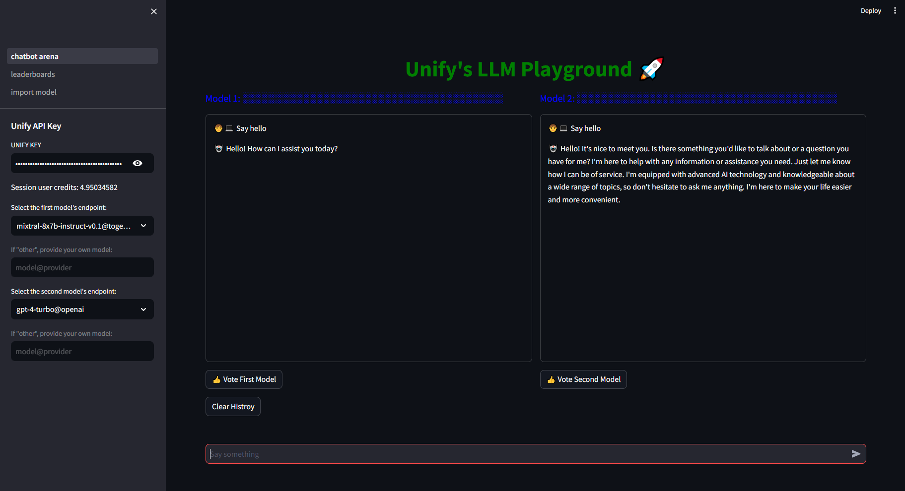

<a href="https://unify-llmplayground.streamlit.app/" target="_blank">
  
</a>


# 


<p align="center">
    <h1 align="center">⚔️ Unify Chatbot Arena: Benchmarking LLMs in the Wild</h1>
</p>
<p align="center">
    <em>This Streamlit application provides a user interface for interacting with Unify models through chat. It allows users to select models and providers, input text, and view the conversation history with AI assistants.
</em>
</p>
<p align="center">
	<!-- Shields.io badges not used with skill icons. --><p>
<p align="center">
		<em>Developed with the software and tools below.</em>
</p>
<p align="center">
	<a href="https://skillicons.dev">
		
	</a></p>


<br><!-- TABLE OF CONTENTS -->
<details>
  <summary>Table of Contents</summary><br>

- [ Overview](#-overview)
- [ Features](#-features)
- [ Repository Structure](#-repository-structure)
- [ Modules](#-modules)
- [ Getting Started](#-getting-started)
  - [ Installation](#-installation)
  - [ Usage](#-usage)
  - [ Tests](#-tests)
- [ Project Roadmap](#-project-roadmap)
- [ Contributing](#-contributing)
- [ License](#-license)
- [ Acknowledgments](#-acknowledgments)
</details>
<hr>

##  Overview
This Streamlit application provides a user interface for interacting with Unify models through chat. It allows users to select models and providers, input text, and view the conversation history with AI assistants.

---

## Features

- **Chat UI**: Interactive chat interface to communicate with AI assistants.
- **Endpoint from Unify**: Choose from a variety of models and providers.
- **Conversation History**: View and track the conversation history with each model.
- **Clear History**: Option to clear the conversation history for a fresh start.


---
## Usage

1. Input Unify API Key: Enter your Unify API key in the provided text input box on the sidebar you can get the api key from [here](https://console.unify.ai/).

2. Select endpoints : Choose the models and providers from the sidebar dropdown menus.

3. Start Chatting: Type your message in the chat input box and press "Enter" or click the "Send" button.

4. View Conversation History: The conversation history with the AI assistant for each model is displayed in separate containers.

5. Clear History: You can clear the conversation history by clicking the "Clear History" button.

6. Vote: you can vote the model which one is doing great as it reflict in leaderboard.

7. Leaderboard: you can see the winner and losser model as globel result.

---
##  Repository Structure
```sh
├── CONTRIBUTING.md
├── Dockerfile
├── LICENSE
├── Procfile
├── README.md
├── __init__.py
├── __pycache__
│   ├── __init__.cpython-310.pyc
│   └── helpers.cpython-310.pyc
├── app_screenshot_from_Kacper.png
├── chatbot_arena.py
├── detail_leaderboards.csv
├── detail_leaderboards.json
├── helpers.py
├── leaderboard.csv
├── models.json
├── pages
│   ├── 1_leaderboards.py
│   └── 2_import_model.py
├── requirements-test.txt
├── requirements.txt
├── test
│   ├── __init__.py
│   ├── __pycache__
│   │   ├── __init__.cpython-310.pyc
│   │   └── test_app.cpython-310-pytest-8.2.0.pyc
│   └── test_helper.py
└── utils
    ├── __init__.py
    ├── logging.py
    └── metadata.py

```

##  Getting Started

**System Requirements:**

* **Python**: `version >=3.10`

###  Installation

<h4>From <code>source</code></h4>

## Setup

1. Clone this repository:

    ```bash
    git clone https://github.com/samthakur587/LLM_playground
    ```
2. change directory
   ```bash
   cd LLM_playground
   ```


3. Install the required dependencies:

    ```bash
    pip install -r requirements.txt
    ```

###  Usage

    ```bash
    streamlit run stream.py
    ```

###  Tests

> Run the test suite using the command below:
> ```console
> $ pytest -v test/*
> ```
---

##  Project Roadmap

- [X] `► building a simple web app`
- [X] `► add gcp templte and dockerfile for deployment`
- [X] `► add precommit hooks for clean code writing`
- [ ] `► merge the webapp into unify demos`
- [ ] `► deploy the webapp to gcp`

---

##  Contributing

Contributions are welcome! Here are several ways you can contribute:

- **[Report Issues](https://github.com/samthakur587/LLM_playground/issues)**: Submit bugs found or log feature requests for the `LLM_playground` project.
- **[Submit Pull Requests](https://github.com/samthakur587/LLM_playground/blob/main/CONTRIBUTING.md)**: Review open PRs, and submit your own PRs.
- **[Join the Discussions](https://github.com/samthakur587/LLM_playground/discussions)**: Share your insights, provide feedback, or ask questions.
---

## Contributing Guidelines

1. **Fork the Repository**: Start by forking the project repository to your github account.
2. **Clone Locally**: Clone the forked repository to your local machine using a git client.
   ```sh
   git clone https://github.com/samthakur587/LLM_playground
   ```
3. **Create a New Branch**: Always work on a new branch, giving it a descriptive name.
   ```sh
   git checkout -b new-feature-x
   ```
4. **Make Your Changes**: Develop and test your changes locally.
5. **Commit Your Changes**: Commit with a clear message describing your updates.
   ```sh
   git commit -m 'Implemented new feature x.'
   ```
6. **Push to github**: Push the changes to your forked repository.
   ```sh
   git push origin new-feature-x
   ```
7. **Submit a Pull Request**: Create a PR against the original project repository. Clearly describe the changes and their motivations.
8. **Review**: Once your PR is reviewed and approved, it will be merged into the main branch. Congratulations on your contribution!

---
## Contributor Graph
<p align="center">
   <a href="https://github.com/samthakur587/LLM_playground/graphs/contributors">
      
   </a>


---
## Used the Unify streaming API
```python
  from unify import AsyncUnify
  import os
  import asyncio
  async_unify = AsyncUnify(
     # This is the default and optional to include.
     api_key=os.environ.get("UNIFY_KEY"),
     endpoint="llama-2-13b-chat@anyscale"
  )
async def main():
   responses = await async_unify.generate(user_prompt="Hello Llama! Who was Isaac Newton?")

asyncio.run(main())
```


## License

This project is licensed under the MIT License - see the [LICENSE](LICENSE) file for details.
---
